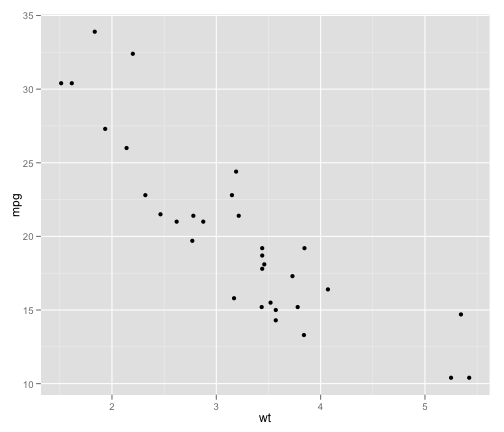
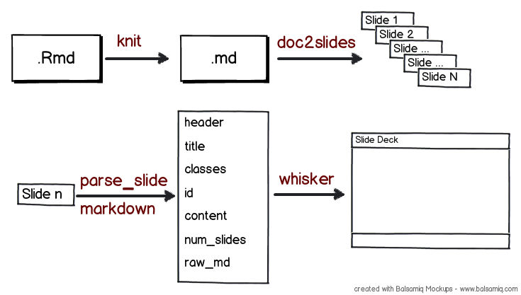

--- #titleslide


<a href="https://github.com/ramnathv/slidify"></a>

# Slidify #
**Reproducible HTML5 Slides Made Easy**

by Ramnath Vaidyanathan

---

<q> Slidify is a tool that makes it easy to create, customize and publish, reproducible HTML5 slide decks using R Markdown.</q>

---

### Install Slidify ###

Slidify can be installed from `github` using `devtools`

```
install.packages('devtools')
require(devtools)
install_github('slidify', 'ramnathv')
```

You also need to install dependencies from `github`

```
install_github('knitr', 'yihui')
install_github('whisker', 'edwindj')
install_github('markdown', 'rstudio')
```

---

<q> Slidify is a tool that makes it easy to <span class = 'red'>create</span>, customize and publish, reproducible HTML5 slide decks using R Markdown.</q>

---

### Create a Slide Deck ###

Write in [R Markdown](http://goo.gl/KKdaf), separating slides by a horizontal rule `---`.

```markdown
  ---
  
  # My First Slidify Deck
  by Ramnath Vaidyanathan
  
  ---
  
  ### Slide 1
  
  This is an unordered list 
  
  - Point 1
  - Point 2
  - Point 3
  - Point 4
  
  ---
```

---

# My First Slidify Deck
by Ramnath Vaidyanathan

---

### Slide 1

This is an unordered list 

- Point 1
- Point 2
- Point 3
- Point 4

---

### Add Slide Classes ###

Add slide classes and id by appending them to the slide separator

```
  --- fill #montreal
  
  ### Montreal by Night Time
  
  
  
  
  --- middle
  
  Slidify is Awesome
  
```

--- fill
 
### Montreal by Night Time
 

 

--- middle

Slidify is Awesome!

---

<q> Slidify is a tool that makes it easy to create, <span class = 'red'>customize</span> and publish, reproducible HTML5 slide decks using R Markdown.</q>

---

### Customize ###

`slidify` is designed to be modular and provide a high degree of customization for the more advanced users.

 Option         | Description
 -------------- | ------------
 framework      | slide generation framework to use
 theme          | theme to use for styling slide content
 highlighter    | tool to use for syntax highlighting
 histyle        | style to use for syntax highlighting
 copy_libraries | copy library files to slide directory?
 lib_path       | path to libraries 
 mathjax        | use mathjax ?
 embed          | embed local images ?
 
---

### Style your Slides! ###

Use the options `framework` and `theme` to style your deck!

 framework | theme
 --------- | --------------------
 [html5slides](http://html5slides.googlecode.com/) | layout-default template-default
 [html5rocks]() |
 [deck.js](http://imakewebthings.com/deck.js/)     | web2.0, swiss, neon
 [dzslides](http://paulrouget.com/dzslides/)       | 
 [landslide](https://github.com/adamzap/landslide) | default, tango, clean
 [shower](http://pepelsbey.github.com/shower/en.htm) | ribbon
 [slidy](http://www.w3.org/Talks/Tools/Slidy2/Overview.html#) |
 [slideous]() |
 [beamer]() | 

---

### Highlight Syntax ###

Use the options `highlighter` and `histyle` to control syntax highlighting

 highlighter     | histyle
 --------------  | ------------
 highlight       | see `knit_theme$get()`
 highlight.js    | see http://goo.gl/uEJj
 google_prettify | see http://goo.gl/yUikj


---

<q> Slidify is a tool that makes it easy to create, customize and <span class = 'red'>publish</span>, reproducible HTML5 slide decks from R Markdown.</q>

---

### Publish Deck ###

Publish your deck on `RPubs` using two lines of code

```
slidify('slides.Rmd', options = list(embed = TRUE))
markdown::rpubsUpload('My First Presentation', 'slides.html')
```

Development is underway to provide support for publishing to 

 * Github Pages
 * Dropbox

---

<q> Slidify is a tool that makes it easy to create, customize publish, <span class = 'red'>reproducible</span> HTML5 slide decks from R Markdown.</q>

---

### Reproducible Deck ###

```
    --- 
  
    ### A Simple Plot
    
    Let us create a simple scatterplot.
  
    ```{r simple-plot, fig.height = 6, fig.align = 'center', message = F}
    require(ggplot2)
    qplot(wt, mpg, data = mtcars)
    ```
  
    --- 
  
    ### A Table
  
    ```{r table, results = 'asis', comment = NA}
    library(xtable)
    options(xtable.type = 'html')
    xtable(head(mtcars))
    ```
  
```

---
 
### A Simple Plot ###

Let us create a simple scatterplot.
 


    require(ggplot2)
    qplot(wt, mpg, data = mtcars)

</div><div class="rimage center"></div><div class="rcode">


---

### A Table


    library(xtable)
    options(xtable.type = "html")
    xtable(head(mtcars))

<!-- html table generated in R 2.15.0 by xtable 1.7-0 package -->
<!-- Tue Jul 10 09:18:24 2012 -->
<TABLE border=1>
<TR> <TH>  </TH> <TH> mpg </TH> <TH> cyl </TH> <TH> disp </TH> <TH> hp </TH> <TH> drat </TH> <TH> wt </TH> <TH> qsec </TH> <TH> vs </TH> <TH> am </TH> <TH> gear </TH> <TH> carb </TH>  </TR>
  <TR> <TD align="right"> Mazda RX4 </TD> <TD align="right"> 21.00 </TD> <TD align="right"> 6.00 </TD> <TD align="right"> 160.00 </TD> <TD align="right"> 110.00 </TD> <TD align="right"> 3.90 </TD> <TD align="right"> 2.62 </TD> <TD align="right"> 16.46 </TD> <TD align="right"> 0.00 </TD> <TD align="right"> 1.00 </TD> <TD align="right"> 4.00 </TD> <TD align="right"> 4.00 </TD> </TR>
  <TR> <TD align="right"> Mazda RX4 Wag </TD> <TD align="right"> 21.00 </TD> <TD align="right"> 6.00 </TD> <TD align="right"> 160.00 </TD> <TD align="right"> 110.00 </TD> <TD align="right"> 3.90 </TD> <TD align="right"> 2.88 </TD> <TD align="right"> 17.02 </TD> <TD align="right"> 0.00 </TD> <TD align="right"> 1.00 </TD> <TD align="right"> 4.00 </TD> <TD align="right"> 4.00 </TD> </TR>
  <TR> <TD align="right"> Datsun 710 </TD> <TD align="right"> 22.80 </TD> <TD align="right"> 4.00 </TD> <TD align="right"> 108.00 </TD> <TD align="right"> 93.00 </TD> <TD align="right"> 3.85 </TD> <TD align="right"> 2.32 </TD> <TD align="right"> 18.61 </TD> <TD align="right"> 1.00 </TD> <TD align="right"> 1.00 </TD> <TD align="right"> 4.00 </TD> <TD align="right"> 1.00 </TD> </TR>
  <TR> <TD align="right"> Hornet 4 Drive </TD> <TD align="right"> 21.40 </TD> <TD align="right"> 6.00 </TD> <TD align="right"> 258.00 </TD> <TD align="right"> 110.00 </TD> <TD align="right"> 3.08 </TD> <TD align="right"> 3.21 </TD> <TD align="right"> 19.44 </TD> <TD align="right"> 1.00 </TD> <TD align="right"> 0.00 </TD> <TD align="right"> 3.00 </TD> <TD align="right"> 1.00 </TD> </TR>
  <TR> <TD align="right"> Hornet Sportabout </TD> <TD align="right"> 18.70 </TD> <TD align="right"> 8.00 </TD> <TD align="right"> 360.00 </TD> <TD align="right"> 175.00 </TD> <TD align="right"> 3.15 </TD> <TD align="right"> 3.44 </TD> <TD align="right"> 17.02 </TD> <TD align="right"> 0.00 </TD> <TD align="right"> 0.00 </TD> <TD align="right"> 3.00 </TD> <TD align="right"> 2.00 </TD> </TR>
  <TR> <TD align="right"> Valiant </TD> <TD align="right"> 18.10 </TD> <TD align="right"> 6.00 </TD> <TD align="right"> 225.00 </TD> <TD align="right"> 105.00 </TD> <TD align="right"> 2.76 </TD> <TD align="right"> 3.46 </TD> <TD align="right"> 20.22 </TD> <TD align="right"> 1.00 </TD> <TD align="right"> 0.00 </TD> <TD align="right"> 3.00 </TD> <TD align="right"> 1.00 </TD> </TR>
   </TABLE>


--- middle

<a href = 'http://yihui.name/knitr'>
  </img>
</a>

---

### knitr = Sweave 2.0 ###

> - Faithful Output.
> - Markup Agnostic.*
> - Language Agnostic.*
> - Flexible Graphics.
> - Beautiful Display.
> - Extensible Design.
> - Enthusiastic Developer.
> - Strong Community.


<p class = 'build'><span class = 'red'><strong>Full Disclosure:</strong> I am an active contributor to `knitr`. So the views expressed here on how awesome knitr is might be biased.</span></p>

---

### Markup Agnostic ###

Currently supports most of the popular markups including

* $\LaTeX$
* Markdown
* ReStructured Text
* HTML

---

### Language Agnostic ###

Here is a code chunk with `python` code.

```python
x = 'hello, python world!'
print x
print x.split(' ')
```
```
hello, python world!
['hello,', 'python', 'world!']
```


Here is a code chunk with `ruby` code

```ruby
x = 'hello, ruby world'
p x.split(' ')

```
```
["hello,", "ruby", "world"]
```

    
---

### Flexible Graphics ###

Complete control over how plots are generated, captured, displayed and saved.

 Option | Values | Description
 ------ | ------ | ------------
 `fig.keep` | 'high', 'all', 'none', 'first', 'last' | what plots to keep
 `fig.show` | 'asis', 'hold', 'animate' | how to display multiple plots
 `fig.width`| 7 | width in inches
 `fig.height`| 7 | height in inches
 `fig.align` | 'default', 'center', 'left', 'right' | how to align plots
 `fig.path` | 'figure/' | path prefix to use
 `dev` | 'pdf', 'png', ... | plotting device to use
 
---

### Beautiful Display ###


 Option | Values | Description
 ------ | ------ | -----------
 `highlight` | TRUE, FALSE | highlight source code ?
 `tidy` | TRUE, FALSE | tidy source using `formatR` ?
 `prompt` | TRUE, FALSE | display prompt ?
 `continue` | TRUE, FALSE | display continuation ?
 `echo` | TRUE, FALSE, 3:7 | display source? what lines ?
 
--- fill

### Strong Community ###

</img>


---

<q> Slidify makes it easy to create, customize and publish, reproducible HTML5 slide decks using <span class = 'red'>R Markdown</span>.</q>

---

</img>

<div class = 'cite'>
  Source: http://www.flickr.com/photos/benjibot/3634418553/
</div>

---

# Demo of Markdown #

---fill

<iframe src = 'http://dillinger.io'></iframe>

---

# R Markdown #

--- fill

</img>

---

### R Markdown = Markdown +++ ###

> - Treat newlines as real line breaks.
> - Ignore intra-word underscores as formatting.
> - Automatically link URLs.
> - Recognize Fenced Code Blocks.
> - Support Tables using [PHP Markdown Extra](http://michelf.com/projects/php-markdown/extra/#table) syntax
> - Better typography using `smartypants`
> - Support for Equations using MathJax
> - Support for Image Bundling using Base64

---

### Display Latex Equations ###

**Raw Latex**
```tex
$$
\begin{aligned}
\dot{x} & = \sigma(y - x) \\
\dot{y} & = \rho x - y - xz \\
\dot{z} & = -\beta z + xy 
\end{aligned}
$$
```

**Rendered Equation**

$$latex
\begin{aligned}
\dot{x} & = \sigma(y - x) \\
\dot{y} & = \rho x - y - xz \\
\dot{z} & = -\beta z + xy 
\end{aligned} 
$$


---

# Demo of R Markdown #

--- fill

<iframe src = 'http://public.opencpu.org/apps/opencpu.demo/markdown/'></iframe>

---

# How does Slidify Work? #


--- middle

### Knit, Split, Parse and Render!

</img>

--- 

# Journey of a Slide #

---

### Source


```markdown
    ---  plot #simple-plot
  
    ### A Simple Plot ###

    Let us create a simple scatterplot.

    ```{r simple-plot, fig.height = 6, fig.align = 'center', message = F}
    require(ggplot2)
    qplot(wt, mpg, data = mtcars)
    ```
  
```

---

### knit! ###

```
 ---  plot #simple-plot

  ### A Simple Plot ###

  Let us create a simple scatterplot.

     require(ggplot2)
     qplot(wt, mpg, data = mtcars)

  <div class="rimage center">
   
  </div>
```

---smaller

```
$header
[1] "<h3>A Simple Plot</h3>"

$level
[1] "3"

$title
[1] "A Simple Plot"

$content
[1] "\n\n<p>Let us create a simple scatterplot.</p>\n\n<pre><code>require(ggplot2)\nqplot(wt, mpg, data = mtcars)\n</code></pre>\n\n<p></div><div class=\"rimage center\"></div><div class=\"rcode\"></p>\n"
  
$sub
[1] TRUE

$id
[1] "slide-20"

$num
[1] 20

$classes
[1] ""

$raw
[1] " \n### A Simple Plot ###\n\nLet us create a simple scatterplot.\n \n```{r simple-plot, fig.height = 6, fig.align = 'center', message = F}\nrequire(ggplot2)\nqplot(wt, mpg, data = mtcars)\n```\n"

```

---

### Layouts

```
<html>
  <head>
    <!-- META DATA  -->
    <!-- SYSTEM STYLE SHEETS -->
  </head>
  <body style='display: none'>
    <section class='slides {{ theme }}'>
      {{#slides}}
      <article class = "{{ classes }}" id = "{{id}}"> 
       {{{ header }}}
       {{{ content }}}
      </article>
      {{/slides}}
    </section>
  </body>
    <!-- SYSTEM JAVASCRIPTS  -->
    <!-- SYSTEM PARTIALS -->
</html>
```

---

### Partials ###

```
{{#mathjax}}
<!-- LOAD MATHJAX JS -->
  <script type="text/x-mathjax-config">
     MathJax.Hub.Config({
       tex2jax: {
         inlineMath: [['$','$'], ['\\(','\\)']],
         processEscapes: true
       }
     });
  </script>
  <script type="text/javascript"  
src="https://c328740.ssl.cf1.rackcdn.com/mathjax/2.0-latest/MathJax.js?config=TeX-AMS-MML_HTMLorMML">
  </script>
  <!-- DONE LOADING MATHJAX -->
{{/mathjax}}
```

---

# Credits #

---

### R Packages ###

All the heavy lifting is actually done by three awesome R packages. `slidify` is merely a wrapper around them. 

* Yihui Xie (knitr)
* RStudio (markdown)
* Edwin de Jonge (whisker)

---

### HTML5 Slide Frameworks ###

`slidify` builds on HTML5 slide frameworks created by several individuals and organizations. I would like to acknowledge their work and efforts.

 Framework | Author  | License
 --------- | ------- | -------
 [HTML5Slides](http://code.google.com/p/html5slides/) | Luke Mah, Marcin Wichary | Apache
 [deck.js](https://github.com/imakewebthings/deck.js) | Caleb Troughton |  MIT/GPL
 [dzslides](https://github.com/paulrouget/dzslides) | Paul Roget | DWTFYW
 [html5rocks](http://slides.html5rocks.com/) | Google | Apache
 [Landslide](https://github.com/adamzap/landslide)| Adam Zapletal| Apache
 [Shower](https://github.com/pepelsbey/shower) | Vadim Makeev | MIT
 [slidy](http://www.w3.org/Talks/Tools/Slidy2/Overview.html#) | Dave Ragett  | MIT
 [slideous]() | Stefan Goessner | LGPL

---

### Syntax Highlighters ###


Syntax highlighting is powered by open source highlighters. I would like to than the authors of these tools.

  Highighter | Author  | License
 --------- | ------- | -------
 [highlight.js](https://github.com/isagalaev/highlight.js) | Software Maniacs | MIT
 [Google Prettify](http://code.google.com/p/google-code-prettify/)| Google| Apache
 [highlight](http://cran.r-project.org/web/packages/highlight/index.html)| Romain Francois | GPL

---

### Markdown-HTML5 Converters ###

I have extensively borrowed ideas and features from HTML5 slide converters written in other languages. I would like to acknowledge contributions of these authors.

 Language | Framework 
 -------- | -----------
 Ruby     | [showoff](http://github.com/schacon/showoff)   
 Ruby     | [slideshow](https://github.com/geraldb/slideshow)  
 Ruby     | [keydown](https://github.com/infews/keydown)   
 Python   | [hieroglyph](https://github.com/nyergler/hieroglyph)  
 Python   | [landslide](https://github.com/adamzap/landslide) 
 Haskell  | [pandoc](https://github.com/jgm/pandoc)


--- #license

<style>
#license p{
  font-family: 'Crimson Text';
  font-size: 22px;
  line-height:26px;
}

</style>

### License ###

`slidify` is made available under the MIT License. All included `css` and `javascript` are licensed under the terms specified by the respective libraries.

**MIT License**

Copyright (C) 2012 Ramnath Vaidyanathan

Permission is hereby granted, free of charge, to any person obtaining a copy of this software and associated documentation files (the "Software"), to deal in the Software without restriction, including without limitation the rights to use, copy, modify, merge, publish, distribute, sublicense, and/or sell copies of the Software, and to permit persons to whom the Software is furnished to do so, subject to the following conditions:

The above copyright notice and this permission notice shall be included in all copies or substantial portions of the Software.

THE SOFTWARE IS PROVIDED "AS IS", WITHOUT WARRANTY OF ANY KIND, EXPRESS OR IMPLIED, INCLUDING BUT NOT LIMITED TO THE WARRANTIES OF MERCHANTABILITY, FITNESS FOR A PARTICULAR PURPOSE AND NONINFRINGEMENT. IN NO EVENT SHALL THE AUTHORS OR COPYRIGHT HOLDERS BE LIABLE FOR ANY CLAIM, DAMAGES OR OTHER LIABILITY, WHETHER IN AN ACTION OF CONTRACT, TORT OR OTHERWISE, ARISING FROM, OUT OF OR IN CONNECTION WITH THE SOFTWARE OR THE USE OR OTHER DEALINGS IN THE SOFTWARE

--- 

# References #

---

### HTML5 Slides with R ###


1. [An Introduction to R](http://goo.gl/L79xW)
2. [How to Make HTML Slides with knitr](http://goo.gl/7C907)
3. [Fancy HTML5 Slides with knitr and Pandoc](http://goo.gl/Uqnq3)
4. [Visualize World Bank Data](http://goo.gl/QlTA4)
5. [Interactive Presentations with deck.js](http://goo.gl/kdhBO)

---

### R Markdown ###

1. [Interactive Reports in R with knitr and RStudio](http://goo.gl/oTeV5)
2. [Getting Started with R Markdown, knitr and RStudio](http://goo.gl/ALjtQ)
3. [Dynamic Content RStudio, Markdown and Marked](http://goo.gl/84D5E)
4. [Using Markdown with RStudio](http://goo.gl/KKdaf)
5. [Example Reproducible Report using R Markdown](http://goo.gl/ZQF1u)
6. [Interactive Slides with R, googleVis and knitR](http://goo.gl/cVS9W)
7. [knitr, Slideshows and Dropbox](http://goo.gl/ZTSD7)

<!-- http://rpubs.com/publish/claim/681/4cbbeb6f03014af79ad87ab44296de3e -->

