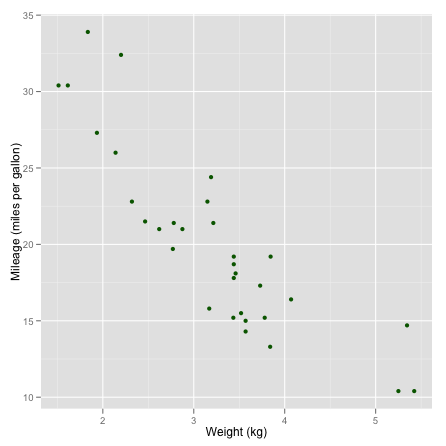
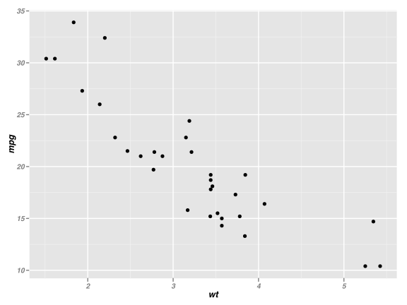

--- #titleslide

# MGCR 271 #
**Business Statistics**

by Ramnath Vaidyanathan

--- #scplot

### Scatterplot ###

<a class = 'definition'>Definition</a>

A **scatterplot** displays the relationship between two numerical variables.

<!-- html table generated in R 2.15.0 by xtable 1.7-0 package -->
<!-- Tue Jul 10 09:23:16 2012 -->
<TABLE border=1>
<TR> <TH>  </TH> <TH> wt </TH> <TH> mpg </TH>  </TR>
  <TR> <TD align="right"> Mazda RX4 </TD> <TD align="right"> 2.62 </TD> <TD align="right"> 21.00 </TD> </TR>
  <TR> <TD align="right"> Mazda RX4 Wag </TD> <TD align="right"> 2.88 </TD> <TD align="right"> 21.00 </TD> </TR>
  <TR> <TD align="right"> Datsun 710 </TD> <TD align="right"> 2.32 </TD> <TD align="right"> 22.80 </TD> </TR>
  <TR> <TD align="right"> Hornet 4 Drive </TD> <TD align="right"> 3.21 </TD> <TD align="right"> 21.40 </TD> </TR>
  <TR> <TD align="right"> Hornet Sportabout </TD> <TD align="right"> 3.44 </TD> <TD align="right"> 18.70 </TD> </TR>
  <TR> <TD align="right"> Valiant </TD> <TD align="right"> 3.46 </TD> <TD align="right"> 18.10 </TD> </TR>
  <TR> <TD align="right"> Duster 360 </TD> <TD align="right"> 3.57 </TD> <TD align="right"> 14.30 </TD> </TR>
  <TR> <TD align="right"> Merc 240D </TD> <TD align="right"> 3.19 </TD> <TD align="right"> 24.40 </TD> </TR>
   </TABLE>

---

### The Correlation Coefficient ###

> - only measures the strength and direction of a `linear` relationship.
> - ignores the distinction between response and explanatory variables.
> - is not affected by changes in the unit of measurement.
> - is always between $\pm 1$
> - is strongly affected by outliers

--- #highway

### Highway Signs ###

A Pennsylvania research firm conducted a study in which 30 drivers (of ages 18 to 82 years old) were sampled, and for each one, the maximum distance (in feet) at which he/she could read a newly designed sign was determined. The goal of this study was to explore the relationship between a driver’s age and the maximum distance at which signs were legible, and then use the study’s findings to improve safety for older drivers. 

--- middle

--- middle

---middle

---middle

Are Hair and Eye Color Associated?

---fill

</img>

<q style='background:rgba(102, 102, 102, 0.5);font-size:80px;color:yellow;'>Are Hair and Eye Color Associated?</q>

---

<iframe src="https://docs.google.com/spreadsheet/embeddedform?formkey=dGd4V1ZlQU5kWXVuYTd1Yy14ODljTnc6MQ" width="760" height="639" frameborder="0" marginheight="0" marginwidth="0">Loading...</iframe>

---

---

### Two Way Tables ###

A `two-way-table` summarizes the relationship between two `categorical` variables using the frequency of occurrence for every possible combination.

<!-- html table generated in R 2.15.0 by xtable 1.7-0 package -->
<!-- Tue Jul 10 09:23:17 2012 -->
<TABLE border=1>
<TR> <TH>  </TH> <TH> Brown </TH> <TH> Blue </TH> <TH> Hazel </TH> <TH> Green </TH> <TH> Sum </TH>  </TR>
  <TR> <TD align="right"> Black </TD> <TD align="right"> 32 </TD> <TD align="right"> 11 </TD> <TD align="right"> 10 </TD> <TD align="right"> 3 </TD> <TD align="right"> 56 </TD> </TR>
  <TR> <TD align="right"> Brown </TD> <TD align="right"> 53 </TD> <TD align="right"> 50 </TD> <TD align="right"> 25 </TD> <TD align="right"> 15 </TD> <TD align="right"> 143 </TD> </TR>
  <TR> <TD align="right"> Red </TD> <TD align="right"> 10 </TD> <TD align="right"> 10 </TD> <TD align="right"> 7 </TD> <TD align="right"> 7 </TD> <TD align="right"> 34 </TD> </TR>
  <TR> <TD align="right"> Blond </TD> <TD align="right"> 3 </TD> <TD align="right"> 30 </TD> <TD align="right"> 5 </TD> <TD align="right"> 8 </TD> <TD align="right"> 46 </TD> </TR>
  <TR> <TD align="right"> Sum </TD> <TD align="right"> 98 </TD> <TD align="right"> 101 </TD> <TD align="right"> 47 </TD> <TD align="right"> 33 </TD> <TD align="right"> 279 </TD> </TR>
   </TABLE>

---

### Notes ###

* Two-way tables organize data about two categorical variables. 
* The row variable is eye color. 
* The column variable is hair color. 
* Each combination of values for these two variables is called a cell. 
* Each cell counts the frequency of occurrence of the combination.

---

### Tale of Three Distributions ###

When dealing with two-way-tables, you will encounter three types of distributions.

> 1. **Marginal Distributions**  specify the distribution of one variable independent of the other variable.
> 2. **Joint Distributions** specify the distribution of combinations of the two variables.
> 3. **Conditional Distributions** specify the distribution of one variable, given the value of the other.

---

### Test Embedding ###

--- shout

## [Demo](http://github.com/ramnathv) ##

--- middle

